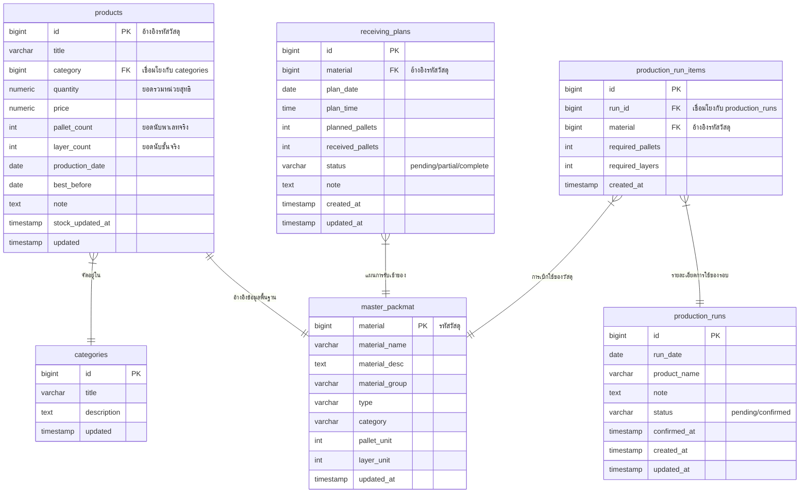

# เอกสารข้อกำหนดระบบ (System Requirements Document)

เอกสารนี้อธิบายถึงข้อกำหนดของ **ระบบบริหารจัดการสต็อกบรรจุภัณฑ์ (Packaging Material Management System)** ซึ่งเป็นเว็บแอปพลิเคชันสำหรับติดตาม ควบคุม และวางแผนวัตถุดิบบรรจุภัณฑ์ที่ใช้ในอุตสาหกรรม โดยระบบถูกออกแบบมาให้ทำงานร่วมกับฐานข้อมูล Supabase และรองรับการทำงานผ่านอุปกรณ์พกพาสำหรับเจ้าหน้าที่คลังวัตถุดิบ

---

## 1. ขอบเขตและภาพรวมระบบ (System Overview & Scope)

ระบบจัดการสต็อกบรรจุภัณฑ์พัฒนาขึ้นเพื่อช่วยแก้ไขปัญหาความซับซ้อนในการนับจำนวนบรรจุภัณฑ์ที่มีหน่วยนับต่างกัน เช่น พาเลท (Pallet) หรือชั้นวาง (Layer) ตลอดจนการจัดการวางแผนการรับวัสดุและการเบิกจ่ายวัสดุตามแผนการผลิตจริงในแต่ละวัน

**คุณสมบัติหลักของระบบประกอบด้วย:**
* **Dashboard:** แสดงสถานะภาพรวม ยอดสรุปจำนวนสินค้าและประเภททั้งหมด
* **Master Material Management & Import:** การจัดการข้อมูลหลักวัสดุ พร้อมระบบรองรับการอัปโหลดไฟล์ Excel เพื่อนำเข้าข้อมูลหลักและยอดนับประจำวันโดยอัตโนมัติ
* **Physical Stock Counting:** ระบบบันทึกยอดนับจริง (พาเลท/เศษชั้น) พร้อมคำนวณเป็นหน่วยย่อยอัตโนมัติ และติดตามวันผลิต/วันหมดอายุ (FIFO/FEFO support)
* **Receiving Planner:** การวางแผนตารางรับเข้าวัสดุบรรจุภัณฑ์ล่วงหน้า และบันทึกยอดรับจริงเข้าคลังวัตถุดิบ
* **Production Run Deductions:** การวางแผนความต้องการใช้วัสดุในการผลิตแต่ละวัน ตรวจสอบความเพียงพอของวัสดุก่อนผลิต และทำธุรกรรมตัดสต็อกจริงจากคลังเมื่อยืนยันการผลิต

---

## 2. ข้อกำหนดการทำงานของระบบ (Functional Requirements)

### 2.1 หน้าแดชบอร์ดสรุปภาพรวม (Dashboard View)
* ระบบต้องแสดงตัวชี้วัดหลัก ได้แก่ มูลค่ารวม (Total Price), ปริมาณคงเหลือรวม (Total Quantity), และจำนวนประเภทสินค้า (Categories)
* แสดงรายการประวัติวัสดุที่มีการเคลื่อนไหวล่าสุด
* มีช่องค้นหา (Search) เพื่อค้นหาบรรจุภัณฑ์ด้วยรหัสสินค้าหรือชื่อสินค้า

### 2.2 การจัดการข้อมูลหลักวัสดุและการนำเข้า (Master Data & Excel Import)
* แสดงรายการวัสดุทั้งหมดจากตาราง `master_packmat` พร้อมระบุหน่วยบรรจุต่อพาเลท (`pallet_unit`) และหน่วยบรรจุต่อชั้น (`layer_unit`)
* รองรับการแก้ไขข้อมูลหลัก เช่น ชื่อรายละเอียด (Material Name/Desc) กลุ่มวัสดุ (Material Group) และประเภทวัสดุ (Type)
* **ระบบนำเข้า Excel (Excel Import Module):**
  * ต้องอนุญาตให้อัปโหลดไฟล์ข้อมูลหลักบรรจุภัณฑ์ (`mater_pk_material.xlsx`) ร่วมกับไฟล์สต็อกประจำวัน (`รายงานขวดและกระป๋อง ประจำวัน.xlsx`) พร้อมกัน
  * ใช้ไลบรารี `SheetJS (XLSX)` อ่านไฟล์แบบ Asynchronous
  * จัดหมวดหมู่ประเภทวัสดุอัตโนมัติจากเนื้อหา (Heuristic Analysis เช่น ขวด หรือ กระป๋อง)
  * ทำการตรวจสอบค่าหน่วยต่อพาเลท/ต่อชั้นเพื่อนำเข้าเป็นหน่วยมาตรฐานในการคำนวณ
  * บันทึกข้อมูลเข้า Supabase แบบแบ่งกลุ่มย่อย (Chunking ครั้งละ 100 รายการ) เพื่อป้องกันข้อจำกัดของเครือข่าย

### 2.3 การบันทึกและตรวจสอบสต็อกสินค้า (Physical Stock Counting)
* แสดงสถานะสต็อกปัจจุบันแบบแบ่งกลุ่มตามประเภทบรรจุภัณฑ์
* คำนวณจำนวนคงเหลือจริงในรูปแบบสูตร:
  $$\text{จำนวนสุทธิ (หน่วย)} = (\text{จำนวนพาเลทเต็ม} \times \text{หน่วยต่อพาเลท}) + (\text{จำนวนเศษชั้น} \times \text{หน่วยต่อชั้น})$$
* การบันทึกสต็อกจริงต้องระบุข้อมูลเพิ่มเติมดังนี้:
  * วันที่ผลิต (Production Date) และวันหมดอายุ (Best Before Date) รูปแบบ `dd/mm/yyyy`
  * บันทึกช่วยจำ (Note) เช่น รหัสการผลิต หรือตำหนิ
* ระบบต้องคำนวณระยะเวลาคงเหลือของบรรจุภัณฑ์ก่อนหมดอายุ (Days Until Expiry):
  * หากหมดอายุแล้ว ให้แสดงผลเป็นสีแดงเตือนชัดเจน
  * หากเหลือเวลาต่ำกว่าหรือเท่ากับ 14 วัน ให้แสดงสีเตือนระดับกลาง

### 2.4 แผนการรับเข้าวัสดุบรรจุภัณฑ์ (Incoming Delivery Planning)
* การเพิ่มแผนการรับวัสดุใหม่ต้องระบุ: รหัส/ชื่อวัสดุ (อิงตาม Master Data), วันที่และเวลาเข้าที่กำหนด, จำนวนพาเลทที่คาดว่าจะรับ (`planned_pallets`), และหมายเหตุ
* ระบบต้องแบ่งระดับสถานะของแผนเป็น 3 ระดับ:
  1. `pending` (รอรับ) เมื่อยังไม่มีการบันทึกยอดรับ
  2. `partial` (รับบางส่วน) เมื่อบันทึกยอดรับเข้าแล้วบางส่วนแต่ยังไม่ครบจำนวน
  3. `complete` (รับครบแล้ว) เมื่อยอดรับจริงมากกว่าหรือเท่ากับยอดตามแผน
* การบันทึกรับเข้าจริงต้องเพิ่มยอดพาเลทสะสมและปรับยอดสต็อกปัจจุบันของวัสดุนั้นในระบบทันที

### 2.5 แผนการผลิตและการตัดยอดสต็อก (Production Planning & Stock Deduction)
* การสร้างแผนผลิต (Production Run) ต้องประกอบด้วย: วันที่ผลิต, ชื่อผลิตภัณฑ์ที่จะผลิต, หมายเหตุ และรายการบรรจุภัณฑ์ที่ต้องการใช้ (ระบุจำนวนพาเลทและชั้นที่ใช้)
* ระบบต้องจำลองการคำนวณล่วงหน้า (Pre-calculation Simulation):
  * คำนวณความต้องการใช้ทั้งหมดเปรียบเทียบกับสต็อกคงเหลือจริง ณ ปัจจุบัน
  * แสดงแถบเตือนสถานะความเพียงพอ (Sufficient Stock Warning) ของแต่ละรายการวัสดุ
* เมื่อมีการกดยืนยันการผลิต (Confirm Production Run):
  * ระบบต้องหักลบจำนวนบรรจุภัณฑ์ที่ใช้ออกจากสต็อกหลักทันที
  * อนุญาตให้สต็อกติดลบได้ (Negative Stock) เพื่อประโยชน์ในการติดตามผลตามจริงของฝ่ายผลิต
  * เปลี่ยนสถานะแผนเป็น `confirmed` และล็อกไม่ให้แก้ไขข้อมูลซ้ำได้อีก

---

## 3. โครงสร้างฐานข้อมูล (Database Schema Requirements)

ระบบเชื่อมต่อกับ PostgreSQL บน Supabase โดยประกอบด้วยตารางข้อมูลดังต่อไปนี้:

---

## 4. ข้อกำหนดที่ไม่เกี่ยวข้องกับฟังก์ชัน (Non-Functional Requirements)

* **ความเข้ากันได้และการออกแบบที่รองรับหลายอุปกรณ์ (Responsive Layout):**
  * หน้าบันทึกสต็อกจริง (`index.html`) และหน้าอื่นๆ ต้องสนับสนุนการทำงานบนเว็บเบราว์เซอร์ของมือถืออย่างสมบูรณ์แบบ เนื่องจากผู้ใช้จำเป็นต้องถือเครื่องไปนับยอดที่หน้างาน
* **สถาปัตยกรรมและเทคโนโลยี (Tech Stack Constraints):**
  * พัฒนาด้วยโครงสร้าง HTML5, Vanilla CSS และ Vanilla JavaScript แบบ ES6 Modules โดยไม่ต้องติดตั้ง Framework อื่นๆ (เช่น React หรือ Vue) เพื่อลดความซับซ้อนของ Build step
  * จัดเก็บข้อมูลหลักไว้ในหน่วยความจำระดับเบราว์เซอร์ชั่วคราว (State cache) เพื่อหลีกเลี่ยงการดึงข้อมูลจาก Database บ่อยเกินจำเป็น (Reduce DB Reads)
  * **การออกแบบระบบไอคอน (UI/UX Icons):** ห้ามใช้ไอคอนประเภท Emoji หรือตัวอักษรพิเศษในการแสดงผลสัญลักษณ์รูปภาพในระบบ ให้ใช้ไอคอนรูปแบบ SVG (Scalable Vector Graphics) ทั้งหมดเพื่อความคมชัด สวยงาม และแสดงผลได้สม่ำเสมอบนระบบปฏิบัติการต่าง ๆ
* **ความปลอดภัยของฐานข้อมูล (Security):**
  * เชื่อมต่อผ่าน Supabase SDK โดยตรงจาก Client-side เพื่อประมวลผลข้อมูลอย่างรวดเร็ว
* **การจัดการข้อผิดพลาด (Robust Error Handling):**
  * กรณีตารางหรือ API ขัดข้องในขั้นตอนใดๆ ระบบต้องแจ้งเตือนข้อผิดพลาดแก่ผู้ใช้ผ่าน Alert Box ชัดเจน พร้อมทั้งกู้คืนสถานะการทำรายการกลับคืนมา (Rollback UI/Cache) เพื่อป้องกันความสับสน
